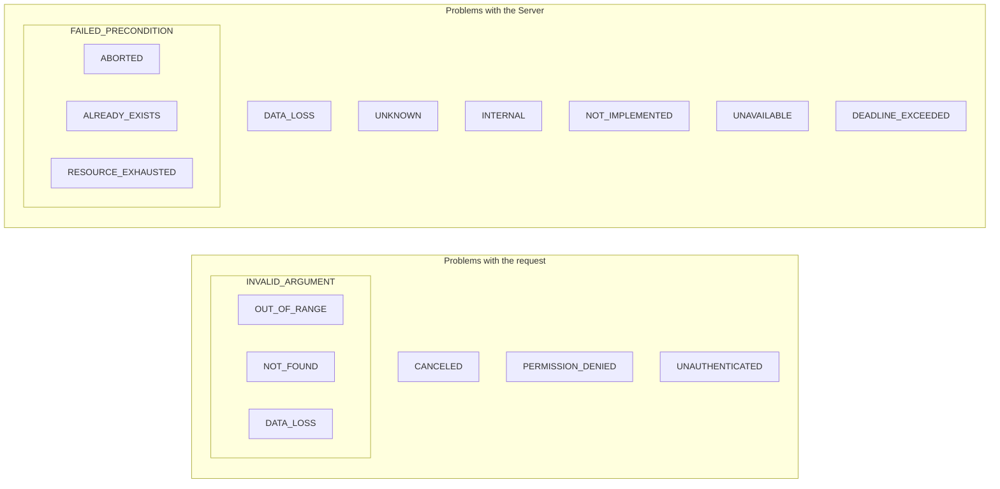

# xerror

An error handling enhancing library that provides an error type that is returnable by both HTTP and gRPC APIs. It's
also useful in applications without any APIs thanks to it offering granular control of logging and builtin retry checks.

The error model it uses is the [Google Cloud APIs error model](https://google.aip.dev/193).

## The problems it solves

1. Defining an error where it happens that isn't just a text string.
2. Provides the ability to wrap errors with a text string that gives more context to the error. It's possible to
   return the error up the call stack, but with more context at each hop.
3. Adding any number of runtime states (variable names and their values) to the error for logging further up the
   call stack.
4. Enables servers to both serve gRPC and HTTP clients without having to translate application errors into gRPC- and
   HTTP-specific variants.
5. Enables servers to hide sensitive data in their error responses.
6. Provides an easy way to set the log-level which can be used by logging libraries so that the errors are logged
   at the desired level.
7. Offers error responses for both gRPC and HTTP that are compliant with [Google Cloud AIP-193](https://google.aip.dev/193) (API Improvement Proposals).

## Usage

Add a call to `xerror.Init()` in your main.go file and run `go mod tidy` optionally followed by `go mod vendor` if
your Go module vendors its dependencies. That call initialises the xerror package. It globally sets the "domain" value
so we don't have to specify it every time we set an [ErrorInfo](https://github.com/googleapis/googleapis/blob/master/google/rpc/error_details.proto#L51) detail in our error. The domain value should be either the name of your service or its domain
name.

```go
// main.go

import "github.com/tobbstr/xerror"

func main() {
    xerror.Init("pubsub.googleapis.com") // replace this string with your service name or service domain as in the example
}
```

Then you're all set! ✅

See the next sections for how to use it for different purposes.

## Error logging

When it comes to logging, as a developer you're interested in two things. First, to log the error and all the relevant
details. Second, to do that at a desired log level.

Ex. Suppose you're making a call to an external system and that it fails. It's a gRPC call and you want to define
an error that captures what went wrong and all the relevant details. This error is meant to be returned up the call
stack until it reaches a point where it should be logged.

```go
import "github.com/tobbstr/xerror/xgrpc"

// skipped for brevity ...

resp, err := otherService.SomeGrpcMethod(&SomeGrpcMethodRequest{
    Name: name, Age: age,
}); err != nil {
    // Initialize a new xerror and add the relevant context to it. Also set its log level
    return xgrpc.ErrorFrom(err).SetLogLevel(xerror.LogLevelError).AddVar("name", name).AddVar("age", age)
}
```

### Adding and using runtime state

Is useful when you want to capture the values of relevant variables when the error happened.

```go
err := someFailingFunction()
if err != nil {
    return xerror.NewInternal(xerror.SimpleOptions{Error: err}).
        AddVar("name", name). // Stores a single variable
        // Stores multiple variables
        AddVars([]xerror.Var{
            { Name: "name", Value: name},
            { Name: "age", Value: age},
        }...)
}
```

Let's say we have the following call stack:

```
entrypoint()                                <- Since it was returned in the previous function it's now here
├─ function_1()                             <- We initialize a new xerror here by calling xerror.NewInternal(...)
   ├─ externallibrary.FailingFunction()     <- Error happened here
```

Now that the error is the furthest it can go in the call stack, it's time to log the error. In the example below
we're using the [zap library](https://github.com/uber-go/zap).

```go
// entrypoint code
{
    // skipped for brevity ...

    err := function_1()
    if err != nil {
        // Log the error
        xerr := xerror.From(err)
        runtimeState := xerr.RuntimeState()
        zapFields := make([]zap.ZapField, len(runtimeState))
        for i, v := range runtimeState {
            zapFields[i] = zap.Any(v.Name, v.Value)
        }

        // We're using the log level of the error to determine the severity of the logged message
        switch xerr.LogLevel() {
        case xerror.LogLevelInfo:
            logger.Info("invoking function_1()", zapFields...)

        // the rest of the cases are skipped for brevity ...

        }
    }
}
```

### Setting the log level

Setting the log level is quite easy as demonstrated in the example below.

```go
return xerror.From(err).SetLogLevel(xerror.LogLevelWarn) // This sets a warning log level
```

## Errors originating from your system

This section demonstrates how to work with errors that happen in your system. Such as when validating arguments,
or checking preconditions etc. In those cases, you're not returned the error from some library or system, but rather
you're the one creating the root error. It's then up to you to classify the error correctly (invalid argument,
aborted, etc.).

### Error constructors

There are constructors that make it easy to initialize errors of different types. The types supported are those
defined in the Google Cloud APIs error model such as:

- INVALID_ARGUMENT
- FAILED_PRECONDITION
- OUT_OF_RANGE
- UNAUTHENTICATED
- PERMISSION_DENIED
- NOT_FOUND
- ABORTED
- ALREADY_EXISTS
- RESOURCE_EXHAUSTED
- CANCELLED
- DATA_LOSS
- UNKNOWN
- INTERNAL
- NOT_IMPLEMENTED
- UNAVAILABLE
- DEADLINE_EXCEEDED

For example, the constructor for the type `unknown` is as follows:

```go
xerror.NewUnknown(SimpleOptions{Error: errors.New("something unknown happened")})
```

### Error type organisation

Below an overview is presented that visualises how the the error types are organised. As can be seen, some error types
are reserved for problems pertaining to a request, and some for problems with the server. Some however appear in both
cases. A few of them are also inside other boxes, for example the `NOT_FOUND` error. The reason it's inside the
`INVALID_ARGUMENT` box, is that it's a specialized version of an `INVALID_ARGUMENT`.



## Errors originating from external systems

It happens that your application is returned an error from an external system such as when calling a gRPC
endpoint. In general, you should inspect the error and create a desired xerror using the [constructors](#error-constructors).
However, in the case of gRPC this library contains a package called `xgrpc` which has a convenience function for the
times you do not want to map the error into a particular xerror, but rather want to keep the status from the external
system. An example of this is given below:

```go
// Example: When you want to keep the returned error status from the external call
resp, err := grpcClient.DoThat()
if err != nil {
    return xgrpc.ErrorFrom(err). // this xerror keeps the error status from err
        AddVar("variable_name_1", valueOfVariable1) // adds context to the error that can be logged easily
}
```

### Advanced error handling

Sometimes it's not enough to just wrap a returned error in an xerror directly. Let's say you need to inspect the
returned error and handle different error types differently. For example, let's say in the case you're out of stock
of pencils, your service is responsible for ordering more of them. When your service makes a call to place an order
for pencils, then it can fail and the returned error may be of a certain type to signify that the order couldn't be
fulfilled due to being out of stock, in which case your service should make another call to order restocking of pencils.

Does Google Cloud APIs error model support this usecase? Yes, it does. The way it handles it is by having an
`ErrorInfo` detail included in the error status.

```json
{
  "error": {
    "code": 8,
    "message": "The order couldn't be fulfilled. The requested item is out of stock",
    "status": "RESOURCE_EXHAUSTED",
    "details": [
      {
        "@type": "type.googleapis.com/google.rpc.ErrorInfo",
        "reason": "OUT_OF_STOCK",
        "domain": "greatpencils.com",
        "metadata": {
          "service": "order.greatpencils.com"
        }
      }
    ]
  }
}
```

Neither the "error.message" nor the "error.status" is meant for these domain-specific errors. Instead it's the
reason field (the "error.details[0].reason" in this example) that is meant to be inspected. The reason only makes
sense in combination with the domain. The reason is domain-scoped. Two different services may have the exact same
reason value, but to distinguish between them the domain must also be taken into account when inspecting.

Luckily the xerror library provides a convenience method on the xerror for checking for domain-specific errors.

```go
resp, err := orderClientpb.OrderPencils()
if err != nil {
    xerr := xgrpc.ErrorFrom(err)
    // The order service has an exported domain constant and an enum for the reason. These are used to check the
    // returned error type.
    if xerr.IsDomainError(orderpb.Domain, orderpb.ReasonOutOfStock) { 
        // handle the case when pencils are out of stock
        restockPencils()
    }
}
```

NOTE! In the example above the order service (which is an external service in this example) exports its domain (ex.
"order.greatpencils.com") and its domain-specific reasons (as enums) that we use for the check. See [Google's
enum definitions](https://github.com/googleapis/googleapis/blob/master/google/api/error_reason.proto) for inspiration.

## Retries

Whenever a function/method or external call etc., is made, it may fail for any number of reasons. For some of them
retrying is futile, but for some it could be worth an attempt or two.

[Retries can be categorised into two types](https://cloud.google.com/apis/design/errors#retrying_errors). One is the retry of the immediate call that failed. The other is the
retry at a higher level in the code. A higher level means futher up the call stack, which could mean a retry of
a whole transaction.

These two categories are supported by the Google Cloud APIs error model, by inspection of the error status' code.
This library reduces the cognitive load of developers by not requiring them to remember which code means that
retries could be attempted.

Two methods are provided that map to these retry categories:

```go
resp, err := orderClientpb.OrderPencils()
if err != nil {
    xerr := xgrpc.ErrorFrom(err)
    if xerr.IsDirectlyRetryable() {
        // implementation skipped for brevity
    } else if xerr.IsRetryableAtHigherLevel() {
        // implementation skipped for brevity
    }
}
```

## Error propagation outside of your domain or bounded context

This section discusses when errors are to be returned to callers of your service. When that happens the first thing
to take into consideration is whether the caller can be considered trusted. Internal services belonging to the same
organsation is often considered trusted, but if they're on public networks such as the Internet, then maybe they
shouldn't be given too much trust.

### Trusted callers

It's completely up to your service what error to return to the caller.

### Untrusted callers

Untrusted callers come in two flavours:

1. Applications such as mobile apps, web apps etc., that belong to your organisation, but they're run on untrusted
networks. In that case only the network is untrusted.
2. The other flavour is completely external code that calls your service. In that case both the caller and the
network it's running on are untrusted.

The recommendation when dealing with untrusted callers, no matter which flavour, is not to include sensitive
information in the error such as stack traces. The xerror library provides a convenience method to do this.

```go
resp, err := orderClientpb.OrderPencils()
if err != nil {
    return xgrpc.ErrorFrom(err). // constructs an xerror from the err
        // marks the xerror as having sensistive details so it will be removed before returning it to the caller
        HideDetails()
}
```

When dealing with untrusted callers of type (1) then the error may be propagated to the caller "as is" as in the
example above, but it's recommended to strip it of sensitive information. For untrusted callers of type (2), it's
[recommended](https://cloud.google.com/apis/design/errors#propagating_errors) the error is translated into a generic "internal server" error without any additional information. This is easily achieved by
using the provided constructors mentioned [here](#error-constructors). See the example below.

```go
resp, err := orderClientpb.OrderPencils()
if err != nil {
    // Returns an INTERNAL error no matter what the external call returned.
    return xerror.NewInternal(SimpleOptions{Error: err}).
        // marks the xerror as having sensistive details so it will be removed before returning it to the caller
        HideDetails()
}
```
